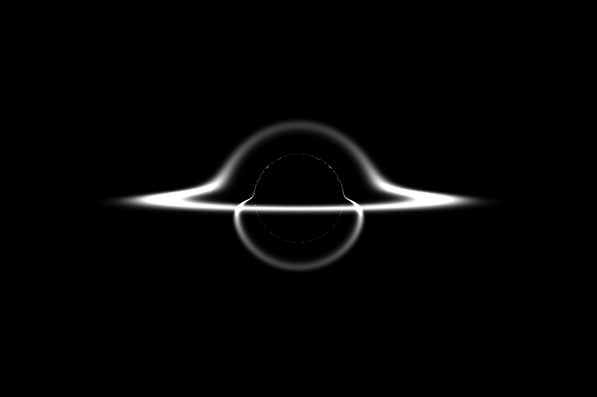

# Black Hole




Black Hole rendering work written in Julia.

Project is work in progress. I used SageMath to calculate the symbolic expressions for the Christoffel symbols of the Eddington-Finkelstein metric, and then hard-coded the non-zero components as Julia functions, which are then used for a geodesic ray-tracing approach to rendering accretion disks around a black hole.

### Currently working on:
- GPU accelerated plots
- Finishing implementation of optically thin disks
- Relativistic effects

## Example Usage
```julia
s = EddingtonFinkelstein(2.0)

geodesics = calcgeodesics(
    s, 
    num=3000, 
    Δϕ=0.002
)

disk = GeometricDisk(
    α=π/50, 
    β=0.0, 
    rinner=12,
    router=44
)

image = renderdisk(
    disk,
    geodesics, 
    height=720, 
    width=1080,
    fov_index=500    
)

# save image
using Images
save("render.png", image)
```

For an optically thin disk, may use
```julia
disk = GaussianThinDisk(
    α=π/50, 
    β=0.0, 
    rinner=12,
    router=44,
    s=s,
    σ=4
)
```
as a drop in replacement for `disk`.